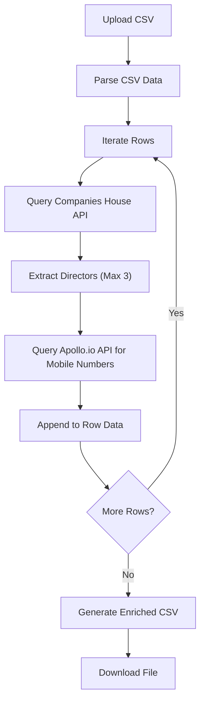

## 1. Product Overview
A web-based internal tool designed to enrich B2B lead lists by processing CSV files. It takes a basic lead list (Company Name, Address, Contact Number, Email) and automatically enriches it with up to 3 Company Directors and their respective mobile numbers.
- Main purpose is to automate the manual research of company directors and their direct contact details.
- Provides immense value by streamlining outbound sales operations and improving data quality.

## 2. Core Features

### 2.1 Feature Module
1. **Upload & Mapping Page**: Drag-and-drop CSV upload, column mapping validation.
2. **Enrichment Dashboard**: Progress tracking, real-time data preview, and error handling.
3. **Export Module**: Download the enriched CSV file.

### 2.2 Page Details
| Page Name | Module Name | Feature description |
|-----------|-------------|---------------------|
| Home / Upload | File Uploader | Drag & drop zone for CSV files, parses headers to ensure required fields exist. |
| Enrichment Dashboard | Processing Table | Displays rows being processed, status indicators (Pending, Success, Failed), and enriched data preview. |
| Export | Download Action | Generates a new CSV containing original data plus Director 1/2/3 Names and Mobile Numbers. |

## 3. Core Process
The user uploads a CSV. The system parses the file and iterates through each row. For each company, it queries the Companies House API to fetch officers (directors). It extracts up to 3 directors. Then, it queries a Contact API (Recommended: Apollo.io) to find the mobile numbers for these specific directors. Finally, the enriched data is compiled and made available for download.

## 4. User Interface Design
### 4.1 Design Style
- **Primary Colors**: Clean, professional B2B palette (Deep Navy `#0F172A`, Electric Blue `#3B82F6` accents).
- **Button style**: Rounded-md, subtle hover transitions, solid for primary actions (Upload, Process).
- **Font**: Inter or Plus Jakarta Sans for a clean, modern SaaS aesthetic.
- **Layout**: Centered card-based layout for the uploader, full-width data table for the enrichment preview.
- **Feedback**: Skeleton loaders for processing rows, toast notifications for errors/success.

### 4.2 Page Design Overview
| Page Name | Module Name | UI Elements |
|-----------|-------------|-------------|
| Upload Page | Hero/Uploader | Dashed border dropzone, cloud icon, clear typography, primary action button. |
| Dashboard | Data Table | Striped rows, status badges (green/yellow/red), horizontal scroll for many columns. |

### 4.3 Responsiveness
Desktop-first design, as CSV processing and data tables are primarily handled on desktop computers. Mobile-adaptive with horizontal scrolling for tables.

### 4.4 Contact Enrichment API Recommendation
For finding mobile numbers, **Apollo.io** is highly recommended over Lusha and Clay for this specific use case. 
- **Apollo**: Offers a robust REST API for "People Search" and "Match", providing excellent B2B coverage for director-level contacts and mobile numbers at a reasonable API cost.
- **Lusha**: Excellent for mobile numbers, but API access is typically restricted to high-tier enterprise plans.
- **Clay**: Clay is an orchestration tool (it calls other APIs like Apollo, Prospeo, etc.). If building a custom tool, it is more cost-effective to call the data provider (Apollo) directly.